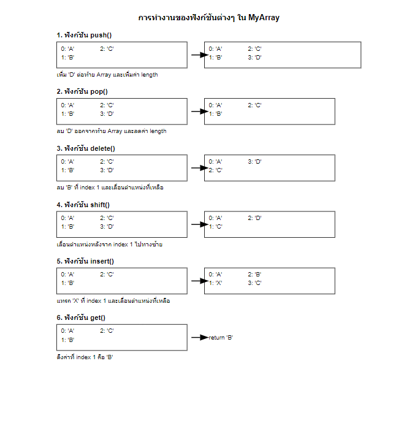

# MyArray Class

MyArray เป็นคลาสที่จำลองการทำงานของ Array ใน JavaScript โดยใช้ TypeScript ซึ่งมีฟังก์ชันพื้นฐานสำหรับการจัดการข้อมูลภายใน Array

## ฟีเจอร์

- `push()`: เพิ่มข้อมูลใหม่ต่อท้าย Array
- `pop()`: ลบข้อมูลตัวสุดท้ายออกจาก Array
- `delete()`: ลบข้อมูลที่ตำแหน่งที่กำหนด
- `shift()`: เลื่อนข้อมูลไปทางซ้ายเพื่อแทนที่ตำแหน่งที่ลบ
- `insert()`: แทรกข้อมูลใหม่ที่ตำแหน่งที่กำหนด
- `get()`: ดึงข้อมูลจากตำแหน่งที่กำหนด


## การใช้งาน

ตัวอย่างการใช้งาน MyArray class:

```typescript
const arr = new MyArray();

// Push
arr.push('20');
arr.push('30');
arr.push('40');
console.log(arr); // { 0: '20', 1: '30', 2: '40' }, length: 3

// Insert
arr.insert(1, '25');
console.log(arr.get(1)); // '25'
console.log(arr); // { 0: '20', 1: '25', 2: '30', 3: '40' }, length: 4

// Delete
arr.delete(2);
console.log(arr); // { 0: '20', 1: '25', 2: '40' }, length: 3

// Pop
const poppedItem = arr.pop();
console.log(poppedItem); // '40'
console.log(arr); // { 0: '20', 1: '25' }, length: 2
```

## API

### `push(_data: any): number`
เพิ่มข้อมูลใหม่ต่อท้าย Array และคืนค่า length ใหม่

### `pop(): any`
ลบข้อมูลตัวสุดท้ายออกจาก Array และคืนค่าที่ถูกลบ

### `delete(_index: number): any`
ลบข้อมูลที่ตำแหน่งที่กำหนดและคืนค่าที่ถูกลบ

### `shift(_index: number): void`
เลื่อนข้อมูลไปทางซ้ายเพื่อแทนที่ตำแหน่งที่ลบ

### `insert(_index: number, _item: any): number`
แทรกข้อมูลใหม่ที่ตำแหน่งที่กำหนดและคืนค่า length ใหม่

### `get(_index: number): any`
ดึงข้อมูลจากตำแหน่งที่กำหนดและคืนค่าที่ได้

